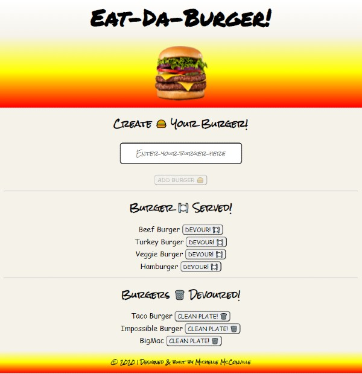

# [13-burger](https://mchel-burger-app.herokuapp.com/) 🔗


## Description

Create a simple full stack burger logger app using MySQL, Node, Express, Handlebars, ORM & Heroku

| ***Screenshot***              |
| :---------------------------: |
|  |

## Table of Contents ✨

* [Installation](#installation)
* [Usage](#usage)
* [Contributing](#contributing)
* [Tests](#tests)
* [Questions](#questions)
* [License](#license)

## Installation 🛠️ <a name="installation"></a>

```node
Type the following two npm commands separately in the Integrated Terminal:
  1. npm init -y
  2. npm i express express-handlebars mysql
```

## Usage ⚙️ <a name="usage"></a>

`Open in Integrated Terminal`

```node
Type the following command to start the application:
npm start
```

## Contributing 🤝 <a name="contributing"></a>

All contributions must be approved by owner

## Tests ✅ <a name="tests"></a>

There are currently no testing procedures for this application

## Questions ❓ <a name="questions"></a>

* 📧 If you have any questions please [**eMail**](mailto:dev.mchel@gmail.com) me
* :octocat: Check out more of my work on [**GitHub**](https://github.com/MichelleMcConville)

## License 📝 <a name="license"></a>

This project is **`Creative Commons`** licensed

---

 Copyright ©️ 2020 🌷 Michelle McConville
